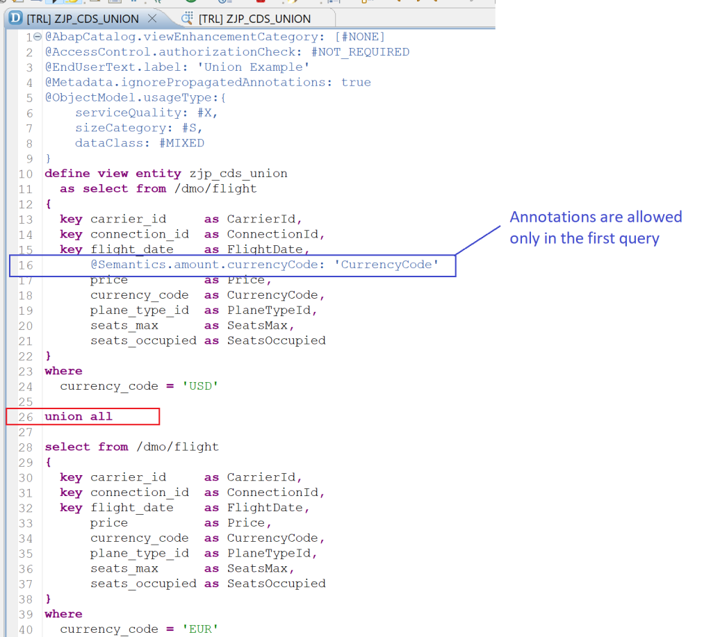

# Exploring ABAP on HANA [2] : Joins in CDS Views

- Buffering should not be enabled for a CDS view with outer join.
- In nested joins, parentheses should be used explicitly to make the code readable.

# Exploring ABAP on HANA [3] : CDS View with parameters

- After the view name, 'with parameters' key words are added
- Parameters are defined as a comma separated list
- Parameter type can be either predefined ABAP types or a data element. Predefined ABAP types for CDS are not same as ABAP data dictionary and input help can be used (Ctrl + Space)
- Default value can be assigned with annotation – @Environment.systemField: #SYSTEM_DATE
- Parameters are optional only when default value is assigned. We can only use system fields such as #SYSTEM_DATE. Possible values are as below.

  
- Parameters can be used in the select field list as it is or for calculation, and using alias for such fields is mandatory
- Parameters can be used in where condition
- Parameters are addressed as :<parameter_name>or $parameters.<parameter_name>

## How to consume CDS with parameters from ABAP?

```
FROM <CDSViewName>( <parameter1> = 'Value1' ,
                    <parameter1> = 'Value2' , 
                    ... )
```

Pass the parameters after the CDS View name in the FROM clause in closed round brackets with a comma separated list.

```
SELECT * FROM zjp_cds_parameters( iv_country_from = 'US',
                                  iv_country_to   = 'DE',
                                  iv_date         = '20201201' )
 INTO TABLE @DATA(flights).
IF sy-subrc EQ 0.
    cl_demo_output=>display( flights ).
ENDIF.
```
# Exploring ABAP on HANA [4] : Extend a CDS View

## The Extension Element List can have below
- Literals, fields, expressions, functions
- Parameters
- Path expressions from association
- Aggregates only if base view contains aggregates (as of 7.51)

## Associations
- View extension can add associations

## GROUP BY Clause (as of release 7.51)
- Only if target view contains a GROUP BY
- Non aggregated new elements should be added to GROUP BY

## UNION(ALL) Statements (as of release 7.51)
- Same number of UNION statements are required when base view contains UNION

## Restricting Extendibility
If you want to restrict what can be extended, use below annotation –
```
@AbapCatalog. viewEnhancementCategory: [#PROJECTION_LIST]
```

Possible values are as below
- #NONE  – No extension
- #PROJECTION_LIST – Extensions of the SELECT list/additional associations
- #GROUP BY – Aggregated or non-aggregated elements
- #UNION – Extensions of the SELECT list of a CDS view with a UNION clause are allowed

It is possible to create multiple extensions for a view. If you are working with custom applications, extension might not be needed, but when you are extending standard applications, it might be useful. However, extending standard views should be done only after lot of consideration and it is a good idea to check with SAP before we do so.

Code Reference
```
"Base Custom View
@AbapCatalog.sqlViewName: 'ZJP_SQL_SMPL'
@AbapCatalog.compiler.compareFilter: true
@AbapCatalog.preserveKey: true
@AccessControl.authorizationCheck: #CHECK
@EndUserText.label: 'Simple CDS View'
define view ZJP_SIMPLE_CDS as select from spfli {
    key carrid as Carrid,
    key connid as Connid,
    countryfr as Countryfr,
    cityfrom as Cityfrom,
    airpfrom as Airpfrom,
    countryto as Countryto,
    cityto as Cityto,
    airpto as Airpto
}

"Extension
@AbapCatalog.sqlViewAppendName: 'ZJP_EXTEND'
@EndUserText.label: 'CDS Extension'
extend view ZJP_SIMPLE_CDS with ZJP_EXTEND_CDS {
    spfli.fltime,
    spfli.distance 
}

"Standard View Extension
@AbapCatalog.sqlViewAppendName: 'ZEXT_STANDARD'
@EndUserText.label: 'Extend Standard CDS'
extend view demo_cds_spfli  with ZJP_EXTEND_STANDAR_CDS {
    spfli.distance
}
```

# Exploring ABAP on HANA [5] : Associations in CDS View

## What is Association?

Associations define relationships between entities such as a database table or another CDS view. Associations can also be viewed as a Join-On-Demand. This means that the association will only be executed when the fields from associated entity are referred. Typically, CDS associations can be compared to LEFT OUTER Joins.

## Cardinality 
Cardinality denotes 1 entry from primary tables has a to b entries in associated table using format [a..b].

- to zero-or-one :  [ 0..1 ] or [ 1 ] or by not specifying anything
- to exactly-one :  [ 1..1 ]
- to many : [ ] or [ * ] or [ n..* ]

| Cardinality | How to write | Meaning |
| :- | :- | :- |
| to zero-or-one | [ 0..1 ] [ 1 ] don’t mention cardinality	 | One record in primary table has zero or one record in associated table
| to exactly-one | [ 1..1 ] |	One record in primary table has exactly one record in associated table
| to many |	[ ] [ * ] [ n..* ] Replace n with a number, usually 0 or 1	| One record in primary table has many records in associated table [ 0..* ] means that associated table has 0 or 1 or 2 or any number of records [ 1..* ] means that associated table has 1 or 2 or any number of records but can not have 0 records


## Using CDS with Associations in ABAP code

- When you are accessing the association fields, use \  followed by association name and use an alias
- In the select field list use alias~fieldname
- Use the FIELDS clause to write fields after the FROM clause – which is easier to write as you have already selected an alias

### Reference Codes:

```
"zjp_cds_left_join

@AbapCatalog.sqlViewName: 'ZJP_CDS_JOIN_L'
@AccessControl.authorizationCheck: #NOT_REQUIRED
@EndUserText.label: 'CDS View with Left Outer Join'
define view zjp_cds_left_join
  as select from scarr left outer join spfli
    on scarr.carrid = spfli.carrid
{ 
  key scarr.carrid      as id, 
  key scarr.carrname    as carrier, 
  key spfli.connid      as flight, 
      spfli.cityfrom    as departure,  
      spfli.cityto      as destination
} 
```

```
"zjp_cds_association_1
@AbapCatalog.sqlViewName: 'ZJP_ASSOC_1' 
@AccessControl.authorizationCheck: #NOT_REQUIRED 
@EndUserText.label: 'Simple Association' 
define view zjp_cds_association_1 as select from scarr 
association [1..*] to spfli as _spfli 
    on $projection.carrid = _spfli.carrid { 
    key scarr.carrid as carrid, 
    scarr.carrname as Carrname, 
    scarr.currcode as Currcode, 
    _spfli                        //Exposed association 
} 
```

```
"Select Queries on Association view
"Without association fields 
    SELECT carrid, carrname 
       FROM zjp_cds_association_1 
       INTO TABLE @DATA(carriers). 
    IF sy-subrc EQ 0. 
      cl_demo_output=>display( carriers ). 
    ENDIF.

"With association fields
    SELECT
       FROM zjp_cds_association_1\_spfli as flight
       FIELDS flight~carrid, flight~connid
       INTO TABLE @DATA(flights).
    IF sy-subrc EQ 0.
      cl_demo_output=>display( flights ).
    ENDIF.
```

```
"Multiple Associations
@AbapCatalog.sqlViewName: 'ZJP_ASSOC_1' 
@AccessControl.authorizationCheck: #NOT_REQUIRED 
@EndUserText.label: 'Simple Association' 
define view zjp_cds_association_1 as select from scarr 
association [1..*] to spfli as _spfli 
    on $projection.carrid = _spfli.carrid 
    association [1..*] to sflight as _sflight 
    on $projection.carrid = _sflight.carrid 
{ 
    key scarr.carrid as carrid, 
    scarr.carrname as Carrname, 
    scarr.currcode as Currcode, 
    _spfli,                        //Exposed association 
    _sflight                       //Exposed association 
}
```

# Exploring ABAP on HANA [6] : Currency/Unit Conversion in CDS Views

In ABAP, we use one of below or similar FM to convert amounts from one currency to another.

CONVERT_AMOUNT_TO_CURRENCY

CONVERT_TO_LOCAL_CURRENCY


The conversion errors can also be handled with possible error handling values as below.

- FAIL_ON_ERROR – an error raises an exception. This is also the default if nothing is specified.
- SET_TO_NULL – the result is reset to null value.
- KEEP_UNCONVERTED – the source value is not changed.

Error handling node is specified as below.


## Unit Conversion
Unit conversion has a similar syntax but it has less parameters than Currency conversion. Here is a standard demo view that explains Unit Conversion.


### Code Reference :

```
"zjp_currency_conv

@AbapCatalog.sqlViewName: 'ZJP_SQL_CC'
@AccessControl.authorizationCheck: #NOT_REQUIRED
@EndUserText.label: 'Currency Conversion'
define view zjp_currency_conv with parameters
    @Environment.systemField: #SYSTEM_DATE
    conv_date       : abap.dats,
    target_currency : abap.cuky
  as select from zmmovie {
  key movie                as Movie,
      @Semantics.amount.currencyCode : 'Currency'
      grosscol             as GrossCollection,
      @Semantics.currencyCode: true
      currency             as Currency,
      
      @Semantics.amount.currencyCode : 'TargetCurrency'
      currency_conversion( amount             => grosscol,
                           source_currency    => currency,
                           round              => 'X',
                           target_currency    => :target_currency,
                           exchange_rate_type => 'M',
                           exchange_rate_date => :conv_date,
                           error_handling     => 'SET_TO_NULL'
                         ) as TargetGrossCollection,
      @Semantics.currencyCode: true
      :target_currency     as TargetCurrency
} 
```

# Exploring ABAP on HANA [7] : Expressions & Operations in CDS Views

## Parameters
In a CDS view with a parameter, a parameter can be addressed with a colon ( : ) or with $parameters.


## Conditions
### Regular Comparisons
```
operand1 =  operand2
operand1 <> operand2
operand1 <  operand2
operand1 >  operand2
operand1 <= operand2
operand1 >= operand2
```

### Between
operand1 between operand2 and operand3

### Pattern comparisons

This is similar to contains string or the like operation that we perform in Open SQL.

What if the data itself has % or _ which you want to search?

Then we can use Escape Character. Suppose movie name was 'Avenger% 1' and we want to search with pattern Avenger%, then we can use the escape character in the pattern string. SAP recommends to use # as escape character.

```
when movie like 'Avenger#%%' escape '#'
```

### Check for null values
```
operand1 is null
operand2 is not null
```

### Type Casting
We have seen this in the currency and unit conversion post.
```
cast( 'EUR' as abap.cuky) as Currency
```

|	Data Type	|	Description	|
| :- | :- |
|	abap.char( len )	|	Character with length specification	|
|	abap.clnt[(3)]	|	Client	|
|	abap.cuky( len )	|	Currency Key	|
|	abap.curr(len,decimals)	|	CURR with length len and decimals decimal places	|
|	abap.dats[(8)]	|	Date	|
|	abap.dec(len,decimals)	|	DEC with length len and decimals decimal places	|
|	abap.fltp[(16,16)]	|	Float	|
|	abap.int1[(3)]	|	INT1	|
|	abap.int2[(5)]	|	INT2	|
|	abap.int4[(10)]	|	INT4	|
|	abap.int8[(19)]	|	INT8	|
|	abap.lang[(1)]	|	Language	|
|	abap.numc( len )	|	NUMC with length len	|
|	abap.quan(len,decimals)	|	QUAN with length len with decimals decimal places	|
|	abap.raw(len)	|	RAW	|
|	abap.sstring(len)	|	SSTRING	|
|	abap.tims[(6)]	|	Time	|
|	abap.unit( len )	|	Unit	|

### Numeric Functions
Below numeric functions are possible.

|	FUNCTION	|	OUTPUT	|
| :- | :- |
|	ABS(arg)	|	Absolute amount	|
|	CEIL(arg)	|	Round Up	|
|	ROUND(arg, pos)	|	Rounding with number of decimal specification	|
|	FLOOR(arg)	|	Round Down	|
|	DIV(arg1, arg2)	|	Quotient	|
|	DIVISION(arg1, arg2, dec)	|	The result is rounded to dec decimal places.	|
|	MOD(arg1, arg2)	|	Remainder	|

### String Functions
Operations like concatenation, Substring, replace, length, left substring, right substring removing right or left blanks or zeros etc. are possible.

```
concat( char1, char2 )               as concat,
length( char1 )                      as length,
left( char1, 3 )                     as left,
lower( char2 )                       as lower,
upper( char2 )                       as upper, 
right( char1, 3 )                    as right,
substring( char1, 3, 3 )             as substring, 
replace( char1, ',' , '.' )          as replace,
concat_with_space( char1, char2, 1 ) as concat_with_space
```

### Decimal Shift
This can be used to get the amount as per the currencies, specially the ones which have other than 2 decimal places.

```
decimal_shift( amount => amount, currency => currency ) as Amount
```

### Date Functions
Functions like add days, add months, days between dates, and date validation can be used in the CDS.

```
dats_add_days     (releasedon, 14, 'INITIAL')  as DateAfter2Weeks,
dats_add_months   (releasedon, 3, 'NULL'   )   as Dateafter3Months,
dats_days_between (releasedon, :iv_curr_date ) as DaysSinceTheRelease,
dats_is_valid     (releasedon)                 as IsValidDate
```

### Nesting Functions
It is also possible to use functions within functions like below which converts time from minutes to format HH:MM.

```
concat( concat(lpad ( ltrim ( cast( div(fltime, 60) as abap.char( 12 ) ), '0' ), 2, '0' ), ':' ) ,
    lpad ( ltrim ( cast( mod(fltime, 60) as abap.char( 12 ) ), '0'), 2, '0' ) ) as Flight_Time
```

This is probably a more complex example which

- gets the number of hours by dividing the time by 60
- casts the results as character
- removes leading zeros if any
- adds leading zero up to 2 places (so that 1 shows as 01)
- repeats this process for minutes, just this time uses mod to get remaining minutes
- then concatenates HH and : into say HH: and then concatenates it with MM to get HH:MM

#### Reference Code
```
ZJP_CDS_EXPRESSIONS

@AbapCatalog.sqlViewName: 'ZJP_SQL_EXP'
@AccessControl.authorizationCheck: #NOT_REQUIRED
@EndUserText.label: 'Various Expressions'
define view zjp_cds_expressions as select from sflight {
    key carrid as Carrid,       //Key Field
    key connid as Connid,       //Key Field
    key fldate as Fldate,       //Key Field
        seatsmax as Seatsmax,   //Non-Key Field
        seatsocc as Seatsocc,   //Non-Key Field
    'Flight' as Title,          //Literal - Text
    10       as Num1,           //Literal - Number
    $session.user            as UserName,
    $session.client          as Client,
    $session.system_language as SystemLanguage
    //$session.system_date     as SystemDate,  
}
```

```
ZJP_10_CDS_EXPRESSIONS

@AbapCatalog.sqlViewName: 'ZJP_10_EXP'
@AccessControl.authorizationCheck: #NOT_ALLOWED
@EndUserText.label: 'CDS Expressions and Operations'
define view ZJP_10_CDS_EXPRESSIONS
  as select from zmmovie
{
  key movie                as Movie,          //Key Field
      phase                as Phase_Orig,
      case phase                              //Simple Case
        when 'Phase 1' then 'First'
        when 'Phase 2' then 'Second'
        when 'Phase 3' then 'Third'
      else 'Fourth'
      end                  as Phase_New,
      case                                    //Complex Case
        when openingcol > 050000000.00 and openingcol <= 100000000.00
          then 'Hit'
        when openingcol > 100000000.00 and openingcol <= 250000000.00
          then 'Superhit'
        when openingcol > 250000000.00
          then 'Blockbuster'
        else 'Flop'
      end                  as Verdict
}
```

```
ZJP_11_CDS_EXPRESSIONS

@AbapCatalog.sqlViewName: 'ZJP_SQL_AGGR'
@AccessControl.authorizationCheck: #NOT_REQUIRED
@EndUserText.label: 'Aggregates'
define view ZJP_11_CDS_EXPRESSIONS
  as select from zmmovie
{
  phase           as Phase,
  @Semantics.amount.currencyCode : 'Currency'
  sum(openingcol) as TotalOpenCollection,
  @Semantics.currencyCode: true
  currency        as Currency
} group by phase, currency
  having sum(openingcol)  > 650000000.00
```

# Exploring ABAP on HANA [11] : CDS Table Function

## What is CDS Table Function?
ABAP CDS table functions define table functions that are implemented natively on the database and can be called in CDS. This is as per the [SAP documentation](https://help.sap.com/doc/saphelp_nw75/7.5.5/en-US/e5/529f75afbc43e7803b30346a56f963/frameset.htm#:~:text=A%20CDS%20table%20function%20is,generated%20in%20the%20ABAP%20Dictionary).

In simple words,

1. CDS table function combines CDS View and AMDP Method
2. It is defined similar to CDS except for data source i.e. you create a field list similar to CDS View
3. The data fetching logic is written inside AMDP Method

## Method Explanation
### Definition

- The method gets Importing and Returning parameters automatically from CDS table function where CDS parameters become the Importing Parameters and it has only one table as returning parameter with fields defined in the CDS.
- FOR TABLE FUNCTION key word followed by CDS Table Function name is used to define the method.

### Implementation

- DATABASE FUNCTION is used in place of DATABASE PROCEDURE. Function returns a single table unlike AMDP which can return multiple tables.
- The parameters defined in CDS Table Function can be directly access here using :parameter_name
- RETURN statement is mandatory here. It can be used to pass result of query directly or any table used in the script.

#  Exploring ABAP on HANA [12] : CDS View Entity

CDS view entities will replace the CDS views. CDS views were first released in ABAP 7.40, SP05. These are declared using DEFINE VIEW and they create a DDIC / ABAP Dictionary view. The annotation @AbapCatalog.sqlViewName is used to specify the DDIC view name.

```
@AbapCatalog.sqlViewName: 'DEMO_CDS_PRJCTN'
@AccessControl.authorizationCheck: #NOT_REQUIRED
define view demo_cds_spfli
  as select from
    spfli
    {
      key spfli.carrid,
      key spfli.connid,
          spfli.cityfrom,
          spfli.cityto
    }
```

The SQL view is created/adjusted in the background during activation which impacts the activation performance. We also need to specify additional annotations for key preservation, client handling etc, but for me the real problem is that the CDS view name and SQL view name must have a different name – managing this becomes difficult at times.

Hence CDS View Entities. Here is one example.

```
@AccessControl.authorizationCheck: #NOT_REQUIRED
define view entity DEMO_CDS_VIEW_ENTITY_KEY
  as select from spfli
{
  key cityfrom,
  key cityto,
      carrid,
      connid
}
```

## Important points to note are

- It is defined with DEFINE VIEW ENTITY
- It has similar syntax to CDS View
- SQL / DDIC view is not created for the entities
- The CDS view entity can be used in ABAP programs using ABAP SQL
- The data source can be database table, CDS view, CDS view entity, CDS table function.

## Advantages of CDS View entity

- No SQL view is generated on activation – hence improved activation performance
- Automatic client handling which is also implicit – no additional annotation is required
- Strict syntax & annotation checks are applied during activation
- Simpler to extend
- New functionalities like regex replace, new operators like EXCEPT & INTERSECT are available from 7.56
- SAP also provides a standard program RUTDDLS_MIGRATION_CANDIDATES to see if migration of CDS View to CDS View Entity is possible and in 7.56 we also get a program RUTDDLSV2MIGRATION that does the actual migration.

## Restrictions

- SELECT * is not allowed
- Client field is not allowed in select list
- DISTINCT and UNION clause were not allowed in version 7.55 but it allowed from version 7.56

As of now, both CDS View and CDS View entities will co-exist. However, if your ABAP version support entities – create entities as eventually we will need to replace the views with entities using the tools provided.

# Exploring ABAP on HANA [12] : CDS View Entity

## What are Virtual elements?
Virtual elements are columns that are not stored in the source database table but are calculated at runtime. Virtual elements represent transient fields in business applications. They are defined at the level of CDS consumption views as additional elements within the SELECT list using specific @DataModel annotations.

## Defining Virtual Elements in CDS Views

Virtual Elements are defined using annotations including below. The virtual element logic is implemented in the class specified.
```
@ObjectModel.virtualElement
@ObjectModel.virtualElementCalculatedBy: 'ABAP:className'
```


```
@AbapCatalog.viewEnhancementCategory: [#NONE]
@AccessControl.authorizationCheck: #NOT_REQUIRED
@EndUserText.label: 'Virtual Elements in CDS'
@Metadata.ignorePropagatedAnnotations: true
@ObjectModel.usageType:{
    serviceQuality: #X,
    sizeCategory: #S,
    dataClass: #MIXED
}
define root view entity ZJP_Virtual_element
  as select from sflight
{
  key carrid                     as Carrid,
  key connid                     as Connid,
  key fldate                     as Fldate,
      @Semantics.amount.currencyCode: 'Currency'
      price                      as Price,
      currency                   as Currency,
      planetype                  as Planetype,
      seatsmax                   as Seatsmax,
      seatsocc                   as Seatsocc,
      @Semantics.amount.currencyCode: 'Currency'
      paymentsum                 as Paymentsum,
      seatsmax_b                 as SeatsmaxB,
      seatsocc_b                 as SeatsoccB,
      seatsmax_f                 as SeatsmaxF,
      seatsocc_f                 as SeatsoccF,
      @ObjectModel.virtualElementCalculatedBy: 'ABAP:ZCL_VIRTUAL_ELEMENT_CALC'
      @EndUserText.label: 'Available Seats'
      @ObjectModel.virtualElement: true
      cast( 0 as abap.int4 )     as SeatsAvailable,
      @ObjectModel.virtualElementCalculatedBy: 'ABAP:ZCL_VIRTUAL_ELEMENT_CALC'
      @EndUserText.label: 'Week Day'
      @ObjectModel.virtualElement: true
      cast( '' as abap.char(9) ) as dayOfTheFlight
}
```

## Create Implementation Class

Create the class and add an interface if_sadl_exit_calc_element_read. Methods calculate and get_calculation_info from the interface needs to be implemented.


```
CLASS zcl_virtual_element_calc DEFINITION
  PUBLIC
  FINAL
  CREATE PUBLIC .

  PUBLIC SECTION.
    INTERFACES if_sadl_exit_calc_element_read.
  PROTECTED SECTION.
  PRIVATE SECTION.
ENDCLASS.

CLASS ZCL_VIRTUAL_ELEMENT_CALC IMPLEMENTATION.


  METHOD if_sadl_exit_calc_element_read~calculate.

    CHECK NOT it_original_data IS INITIAL.

    DATA : lt_calculated_data TYPE STANDARD TABLE OF ZJP_Virtual_element WITH DEFAULT KEY.

    MOVE-CORRESPONDING it_original_data TO lt_calculated_data.

    LOOP AT lt_calculated_data ASSIGNING FIELD-SYMBOL(<flight>).
      <flight>-SeatsAvailable =  <flight>-Seatsmax - <flight>-Seatsocc.
      <flight>-dayOfTheFlight = cl_reca_date=>get_weekday( <flight>-Fldate ).
    ENDLOOP.

    MOVE-CORRESPONDING lt_calculated_data TO ct_calculated_data.

  ENDMETHOD.


  METHOD if_sadl_exit_calc_element_read~get_calculation_info.
    et_requested_orig_elements = VALUE #( BASE et_requested_orig_elements
                                          ( CONV #( 'SEATSOCC' ) )
                                          ( CONV #( 'SEATSMAX' ) )
                                          ( CONV #( 'FLDATE' ) )
                                        ).
  ENDMETHOD.
ENDCLASS.
```

# Exploring ABAP on HANA [13] : Union in CDS

## Important Points
- The result sets must have the same number of elements
- They key elements of all SELECT lists must match.
- The element pairs that occur in the same position of the result set must have a compatible data type. The names can be different. CAST keyword can be used to convert data into same data types.
- Annotations can be defined only in the first select branch.
- A union result set can itself be the left side of a further union.
- If the addition ALL is specified, all entries, even duplicates, are listed in the result set. If ALL is not specified, all duplicate entries are removed from the result set. A keyword DISTINCT can also be specified explicitly.
- If the addition ALL is specified, all data types are possible in a union view.
- Only one field with data type LRAW/LCHR is allowed and it must be at the end of the view with a field just before such field representing the maximum length of such field. The length field would be of type INT2 or INT4.
- Without the addition ALL, data types STRING, RAWSTRING, LCHR, LRAW, and GEOM_EWKB are not supported.



```
@AbapCatalog.viewEnhancementCategory: [#NONE]
@AccessControl.authorizationCheck: #NOT_REQUIRED
@EndUserText.label: 'Union Example'
@Metadata.ignorePropagatedAnnotations: true
@ObjectModel.usageType:{
    serviceQuality: #X,
    sizeCategory: #S,
    dataClass: #MIXED
}
define view entity zjp_cds_union
  as select from /dmo/flight
{
  key carrier_id     as CarrierId,
  key connection_id  as ConnectionId,
  key flight_date    as FlightDate,
      @Semantics.amount.currencyCode: 'CurrencyCode'
      price          as Price,
      currency_code  as CurrencyCode,
      plane_type_id  as PlaneTypeId,
      seats_max      as SeatsMax,
      seats_occupied as SeatsOccupied
}
where
  currency_code = 'USD'

union all

select from /dmo/flight
{
  key carrier_id     as CarrierId,
  key connection_id  as ConnectionId,
  key flight_date    as FlightDate,
      price          as Price,
      currency_code  as CurrencyCode,
      plane_type_id  as PlaneTypeId,
      seats_max      as SeatsMax,
      seats_occupied as SeatsOccupied
}
where
  currency_code = 'EUR'
```

### Selects from different sources

```
@AbapCatalog.sqlViewName: '...'
define view ... as
  select
    from demo_join1
      { a as c1, b as c2, c as c3, d as c4 }
    union
      select
        from demo_join2
          { d as c1, e as c2, f as c3, g as c4 }
```

### Select list containing different elements

```
@AbapCatalog.sqlViewName: '...'
define view ... ( c1, c2, c3, c4 ) as
  select
    from demo_join1
      { a, b, c, d }
    union
      select
        from demo_join2
          { d, e, f, g }
```